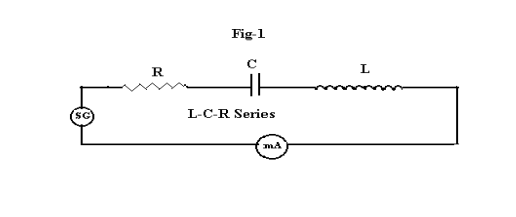

<h2> Theory:</h2>  

(Series L-C-R) When the resistor R, inductor L and
capacitor C are connected in series with a source of emf E , the circuit is called as the
series resonant or series tuned circuit ( figure-1). This is an acceptor circuit, that means it
allows maximum current to flow through it at a particular ( resonant ) frequency and at all
other frequencies it allows less current. 
 

 
In A.C. circuits the voltage and the current are usually out of phase. Across the
inductor, the current lags behind the voltage by 900
, where as across the capacitor, the
current leads the voltage by 900
. But across the resistor the voltage and current both are in phase. Under certain conditions, the voltage and current are in phase, even though the
circuit consists of L , C and R and the circuit behaves as a pure resistor. This
phenomenon is called resonance. This occurs at a single frequency known as resonant
frequency. At this frequency the capacitive reactance( Xc = 1/ωC) and the inductive
reactance( XL = ωL) are equal and opposite in direction. So they get cancelled each other
and only resistance acts. 

<b>The impedance of the circuit is given by</b>  
Z = R + j (ωL- 1/ωC )  
<b>At resonance the reactive term disappears</b>  
ωL - 1/ωC = 0            
<b>The impedance is minimum i.e.</b>  
Z = R  
<b>The current is maximum </b> 
<b>So </b>      
        ωL = 1/ωC  

   
 

At this frequency the current is maximum and this frequency f0 is called resonant
frequency. The circuit has selective properties. To compare selectivity or sharpness of
resonance, a band of frequencies is chosen at which the current falls to
2
1
 times ( half
power points ) of its maximum value. The frequency difference (f2 – f1 ) between the half
power points is called the bandwidth.

